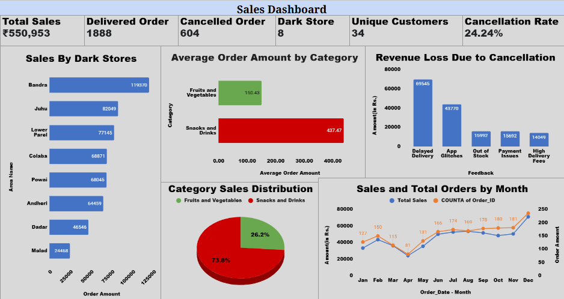

# 📦 Baskit Order & Cancellation Analysis

## 📌 Project Overview
Baskit is a premium grocery delivery service in Mumbai, specializing in **fresh fruits, vegetables, snacks, and drinks**.  
The goal of this project is to clean, process, and analyze order data from top customers to gain insights into **sales trends** and **cancellation patterns**—ultimately improving service quality and customer satisfaction.

---

## 🎯 Project Objectives
1. **Data Cleaning**  
   - Transform raw order transaction records into a clean, structured format.
   - Ensure accuracy in customer details, order amounts, and delivery statuses.

2. **Order Data Analysis**  
   - Extract **item prices** and **categories** for each order.
   - Calculate total order amounts and aggregate sales metrics.

3. **Sales Dashboard Creation**  
   - Visualize sales performance using interactive charts and KPIs.
   - Highlight top-selling products and trends over time.

4. **Cancellation Analysis**  
   - **Dark Store-wise Cancellation Analysis**: Identify stores with higher cancellation rates.  
   - **Cancellation Feedback Analysis**: Analyze reasons for cancellations dynamically.  
   - **Feedback Causes Analysis**: Highlight top two reasons for cancellations with deeper insights.

---

## 📂 Dataset Description
- **Data Sheet**: Raw order transaction records from the past year.  
- **Data Cleaning Sheet**: Structured, cleaned dataset ready for analysis.  
- **Order_Data Sheet**: Processed order-level details with prices, categories, and totals.  
- **Sales Dashboard**: Visual representation of sales trends and KPIs.  
- **Cancellation Report**: Detailed breakdown of cancellation patterns.

---

## 🛠 Tools & Technologies
- **Google Sheets** – Data cleaning, aggregation, and dashboard creation.
- **Excel** – Advanced formulas and pivot tables for analysis.
- **Data Visualization** – Conditional formatting, charts, and interactive dropdowns.

---

## 📊 Key Insights 
- Identify high-performing and low-performing dark stores.
- Recognize primary causes of order cancellations.
- Track sales trends and top product categories.

---

## 📸 Screenshots 

